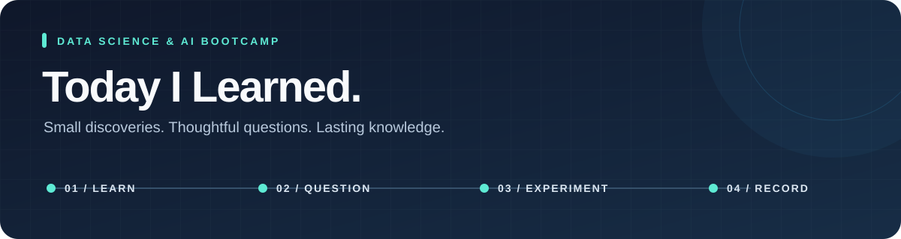

<p align="center">
  
</p>

<h1 align="center">배우고, 질문하고, 기록합니다.</h1>

<p align="center"><strong>Data Science & AI Bootcamp · TIL & Devlog</strong></p>

<p align="center">
  <a href="#learning-log">📚 학습 기록</a> &nbsp; · &nbsp;
  <a href="./docs/topics.md">🧭 주제별 탐색</a> &nbsp; · &nbsp;
  <a href="./template.md">✍️ 작성 템플릿</a> &nbsp; · &nbsp;
  <a href="#writing-guide">📝 작성 가이드</a>
</p>

> 9.5개월간의 데이터 사이언스 & AI 서비스 개발 과정을 기록하는 개발 일지(Devlog) 저장소입니다.<br>
> 수업에서 배운 내용, 궁금했던 질문, 직접 해본 실험과 해결 과정을 기록합니다. 개념을 이해한 날은 짧은 TIL로, 프로젝트 문제를 해결한 날은 자세한 Devlog로 남깁니다.


<br>

| 📖 TIL · 개념을 이해한 날 | 🔬 Devlog · 문제를 해결한 날 |
| :--- | :--- |
| 배운 개념과 질문, 이해한 답을 짧게 정리합니다. | 문제와 실험, 해결 과정과 배운 점을 자세히 남깁니다. |

<a id="learning-log"></a>

## 📚 Learning Log

<!-- 목차 시작: tools/build_index.py 가 생성합니다. 직접 고치지 마세요. -->

| 월 | 기록 | 주요 단계 | 월별 목차 |
| :---: | :---: | :--- | :---: |
| **2026-08** | 16건 | Python · SQL · Quant · AI | [열기](./2026-08/README.md) |
| **2026-09** | 15건 | Quant · ML · Stats · DevOps | [열기](./2026-09/README.md) |

기록 31건. 날짜를 모를 때는 [주제별 색인](./docs/topics.md)에서 찾습니다.

<!-- 목차 끝 -->

<br>

## 🧰 Toolbox

| 분야 | 기술 및 도구 |
| :--- | :--- |
| **Language & Tools** |     |
| **Database** |    |
| **Analysis & ML** |    |
| **Apps & Visualization** |    |

<br>

## 💡 학습 및 작성 원칙

1. **배운 만큼 기록하기:** 질문 하나를 이해한 날도 TIL로 남깁니다. 실험이나 트러블슈팅이 없는 날은 해당 항목을 생략합니다.
2. **사실과 추측 구분하기:** 직접 실행한 결과, AI가 제안한 예시, 아직 확인하지 않은 가설을 구분합니다. 제공되지 않은 수치나 경험을 만들어 넣지 않습니다.
3. **다시 이해할 수 있게 쓰기:** 중요한 질문, 코드, 오류 메시지, 실행 조건, 출처를 보존합니다. 특정 실험의 결과를 보편적 결론으로 단정하지 않습니다.
4. **간결하게 유지하기:** 주제 요약은 한 줄로 적고, 퀀트 연결이나 거창한 성과 표현을 의무화하지 않습니다. 기존 기록은 당시 형식을 유지합니다.

<br>

<a id="writing-guide"></a>

## ✍️ Writing Guide

**수업과 질문 → 하루 마무리 요약 → TIL 작성 → 목차 갱신**

<details>
<summary><strong>📝 하루 기록 흐름과 요약 요청문</strong></summary>

### 1. 수업과 질문

일반 ChatGPT에서 수업 내용, 개념 질문, 자유로운 질의응답을 진행합니다. 저장소 파일을 직접 읽거나 실행해야 하는 작업은 해당 프로젝트에서 진행합니다.

### 2. 하루 마무리 요약

학습한 대화에서 아래 요청문을 사용합니다. 대화가 여러 개라면 각 요약을 모읍니다.

```text
오늘 대화에서 TIL에 남길 학습 내용을 주제별로 정리해줘.
내가 한 질문, 이해한 답, 직접 실행한 코드와 결과, 미해결 질문을 보존해줘.
AI가 제안한 코드와 내가 실제 실행한 코드를 구분하고,
중요한 수치·오류 메시지·출처를 남겨줘.
실행하지 않은 실험이나 확인하지 않은 결론은 만들지 마.
```

### 3. 이 저장소에서 TIL 작성

[작성 요청 템플릿](./template.md)에 학습 날짜를 지정하고, 요약과 중요한 코드·로그 원문을 붙여 넣습니다. 다른 대화의 내용을 이미 알고 있다고 가정하지 않고 필요한 자료를 함께 전달합니다.

TIL 파일을 작성한 뒤 목차를 다시 만듭니다. 목차 표를 직접 고치지 않습니다.

```powershell
python tools/build_index.py
```

머리말의 `단계`는 `Stats / ML / Quant` 처럼 사선으로 구분해 적습니다. 이 값이 주제별
색인의 분류가 됩니다. `주제` 한 줄이 목차에 그대로 실리므로, 그날을 한 줄로 설명할
수 있게 적습니다. 같은 날짜 파일이 이미 있으면 기존 내용을 보완하고 새 파일을 만들지
않습니다.

커밋 전에 목차가 기록과 맞는지 확인하려면 다음을 실행합니다.

```powershell
python tools/build_index.py --check
```

기본 양식은 아래와 같습니다. 내용이 없는 항목은 생략하고 번호를 맞춥니다.

- 오늘 배운 것
- 내가 궁금했던 질문과 이해한 답
- 직접 해본 것과 결과 — 실행한 경우에만
- 아직 헷갈리는 것 / 다음에 확인할 것

프로젝트 문제 해결이 중심인 날에는 기존의 **문제 → 실험 → 해결 → 배운 점** 형식을 사용해도 됩니다.

</details>

<details>
<summary><strong>🛠️ 빈 양식 생성 · 직접 작성할 때</strong></summary>

AI에게 파일 작성을 맡길 때는 스크립트를 먼저 실행할 필요가 없습니다. 직접 작성할 빈 양식이 필요할 때 저장소 루트에서 실행합니다.

```powershell
# 오늘 날짜 (컴퓨터의 로컬 날짜)
python create_til.py

# 지난 학습 내용을 나중에 정리할 때
python create_til.py 2026-09-15
```

Python 3.10 이상과 표준 라이브러리만 사용합니다. Python 명령이 등록되지 않았다면 설치된 인터프리터 경로로 실행합니다. 이 저장소에 사용 가능한 가상환경이 있다면 다음과 같이 실행할 수 있습니다.

```powershell
.\.venv\Scripts\python.exe create_til.py 2026-09-15
```

스크립트는 월별 폴더와 빈 마크다운 파일만 생성하며, 기존 파일은 덮어쓰지 않습니다. AI 호출, 내용 정리, README 목차 갱신은 수행하지 않습니다.

</details>

<details>
<summary><strong>📂 저장소 구조와 목차 관리</strong></summary>

```text
.
├── README.md                 # 사용 안내 및 월별 요약 목차
├── template.md               # 학습 자료를 TIL로 정리하는 요청문
├── create_til.py             # 빈 TIL 양식 생성 (선택 사항)
├── main.py                   # 기존 브랜치 연습 파일
├── docs/
│   ├── assets/               # README 배너
│   └── topics.md             # 주제별 색인 (자동 생성)
├── tools/
│   ├── build_index.py        # 기록 머리말을 읽어 목차를 생성
│   └── legacy_index.tsv      # 초기 형식 기록의 목차 정보 보존
├── 2026-08/                  # YYYY-MM-DD.md 형식의 일별 기록
│   └── README.md             # 그 달의 일별 목차 (자동 생성)
└── 2026-09/
    └── README.md
```

목차는 손으로 고치지 않습니다. 각 기록 머리말의 `날짜·단계·주제`가 원본이고,
README의 월별 요약과 월별 목차, 주제별 색인은 모두 거기서 생성합니다. 같은 설명을
두 곳에 적어 두면 시간이 지나며 서로 어긋나기 때문입니다.

</details>

---

<p align="center"><sub>작은 배움도, 해결하지 못한 질문도 다음 기록의 출발점이 됩니다.</sub></p>
